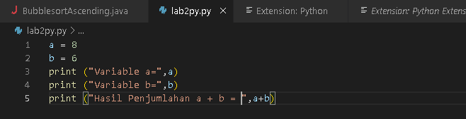

## lab2py

- FAQIH IRIANTO (312210021)
- Disini saya menggunakan Aplikasi Code Editor Visual Studio Code

- Latihan 1

- Berlatih menggunakan fungsi Print 
    - Menampilkan tulisan Hello (Output)
    - Menampilkan Output print "Saya sedang belajar python"

    - Disini saya menggunakan Command Prompt (CMD) dari windows untuk media mengetikkan kode dan menampilkan Output
    - Mengetik perintah menampilkan Hello dan Saya sedang belajar python

- Latihan 2

    - Belajar untuk menggunakan perintah input dimana ketika kita mencantumkan nama dan umur yang ingin kita tampilkan maka outputnya akan menampilkan nama dan umur kita sesuai dengan perintah

    - Contoh hasil Outputnya

- Latihan 2 program penjumlahan dua buah bilangan

    - Mendefinisikan variable a = 6 dan b = 8
    - Mencetak hasil penjumlahan dan nilai variable a & b

    - Hasil Outputnya

- Latihan 3

- Menggunakan IDLE (Integrated Development Environment)

    - Ketikkan kode sebagai berikut

    - Outputnya menampilkan hasil penggabungan, penjumlahan, dan pembagian

- TERIMA KASIH!